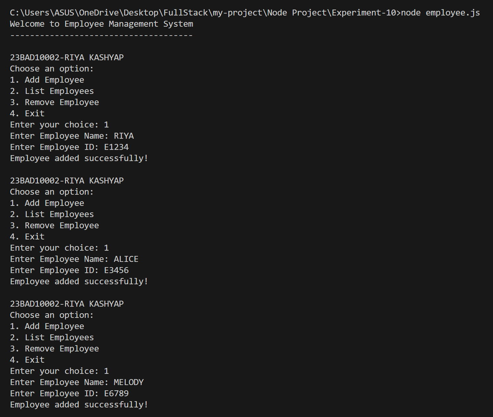
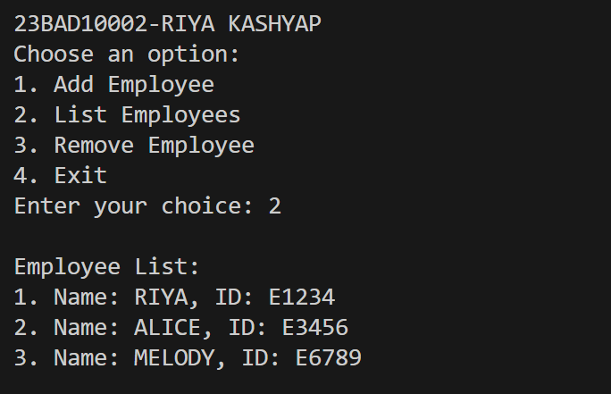
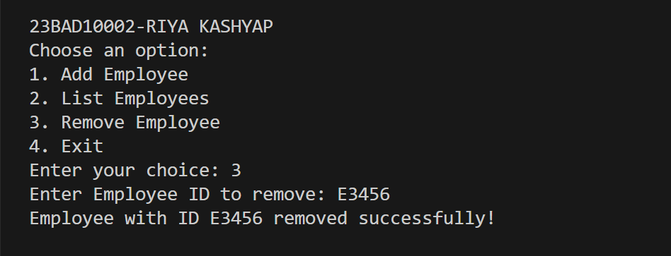
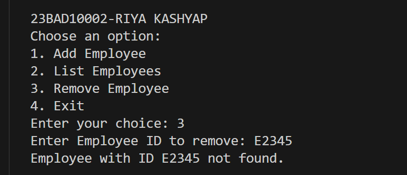
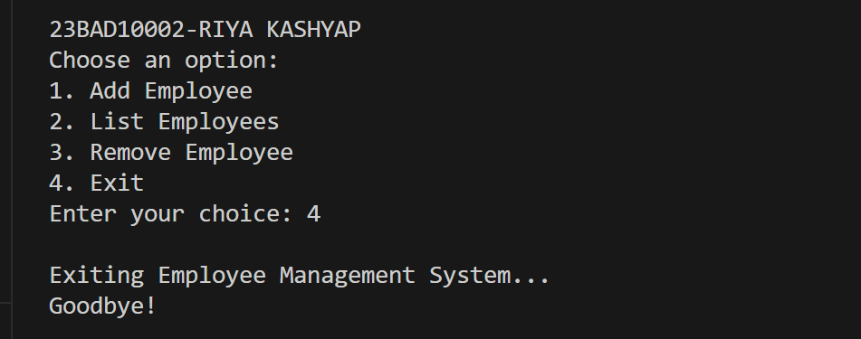

# Employee Management System (Node.js CLI)

This is a simple **Command-Line Interface (CLI) project** built using **Node.js** that allows users to manage employees.  
Users can **add, view, and remove employees** interactively via the terminal.  


## Project Structure
- `employee.js` → The main JavaScript file containing all the logic.  

## Features
1. **Add Employee** → Allows the user to add an employee with a name and ID.  
2. **List Employees** → Displays all employees with their details.  
3. **Remove Employee** → Deletes an employee by their ID.  
4. **Exit** → Closes the program safely.  

## How It Works
1. The program starts with a **welcome message** and displays a menu with options.  
2. Users interact with the menu by entering their choice.  
3. Based on the choice:
   - **1** → Add employee details (Name & ID).  
   - **2** → Show the employee list.  
   - **3** → Remove employee by ID.  
   - **4** → Exit the system.  

## Code Explanation
The code begins by importing **Node.js’s readline module**, which enables interaction with the user through the terminal.  

- **Interface Setup**  
  - `readline.createInterface` is used to create input/output streams for reading user input and displaying output.  

- **Data Storage**  
  - An array named `employees` is used to store employee objects. Each employee has two properties:  
    - `id` → A unique identifier for the employee.  
    - `name` → The employee’s name.  

- **Menu Display**  
  - The `showMenu()` function displays the available options and takes user input to decide what to do next.  

- **Add Employee**  
  - The `addEmployee()` function prompts the user for an employee’s name and ID.  
  - The employee object is then stored in the `employees` array.  

- **List Employees**  
  - The `listEmployees()` function checks if there are employees in the system.  
  - If yes, it lists them with their name and ID in order.  
  - If no employees exist, it displays a message.  

- **Remove Employee**  
  - The `removeEmployee()` function asks for an employee ID.  
  - It searches the `employees` array for a match and removes the employee if found.  
  - If no employee is found with the entered ID, a message is shown.  

- **Exit**  
  - When the user selects **4**, the program prints a goodbye message and ends execution using `rl.close()`.  

- **Unique Identity**  
  - `"23BAD10002-RIYA KASHYAP"` has been included in the menu header for unique identification of this code.  

## Usage
1. Open your terminal.  
2. Navigate to the folder where the file is saved.  
3. Run the file using:  

```bash
node employee.js
```

## Outputs
### Adding an Employee


### Listing Employees


### Removing an Employee


### Invalid Employee ID


### Exiting the System



## Learning Outcomes
- Gained hands-on experience in building a **Command-Line Interface (CLI)** application using Node.js.  
- Learned how to use the **readline module** for interactive user input in the terminal.  
- Strengthened understanding of **array operations** such as inserting, displaying, and deleting records.  
- Practiced writing a **menu-driven program** to handle multiple functionalities smoothly.  
- Improved skills in **JavaScript functions, conditionals, and modular coding practices**.  
- Understood how to manage **in-memory data structures** without using databases or files.  
- Enhanced ability to design simple yet effective applications for real-world use cases.  