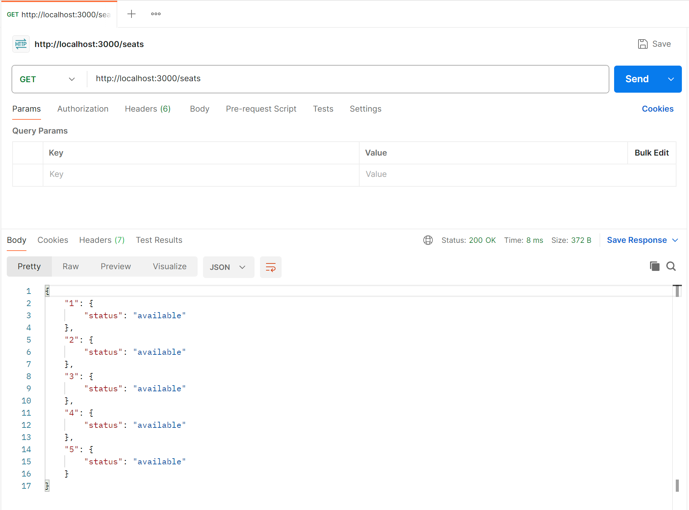
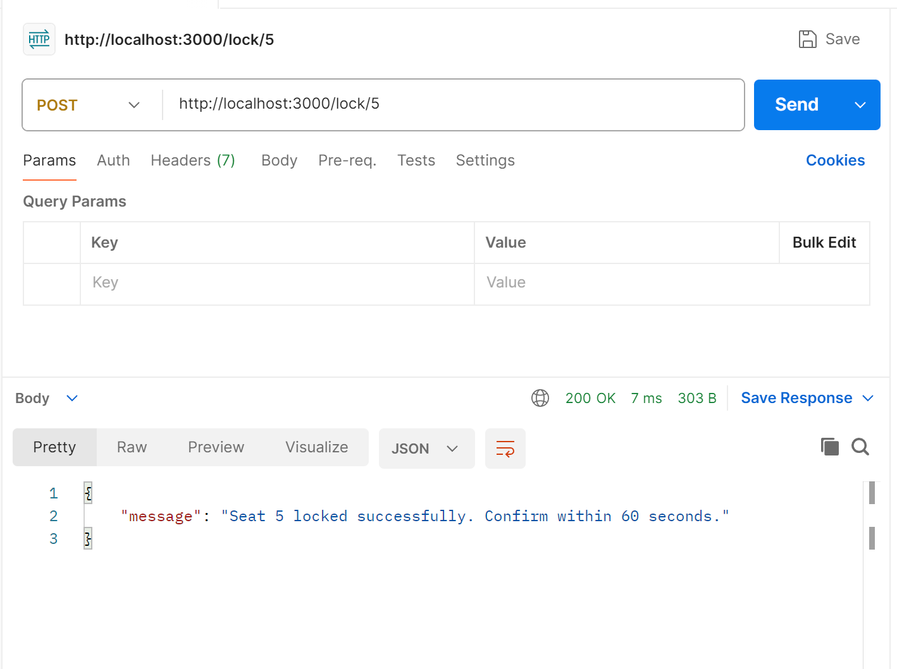
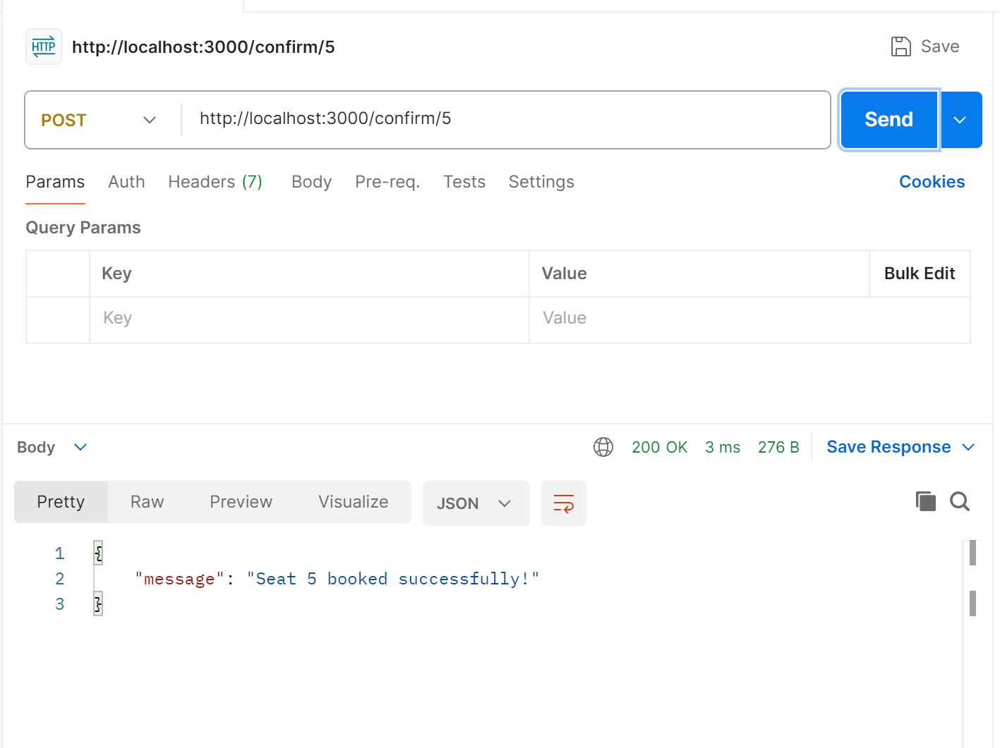
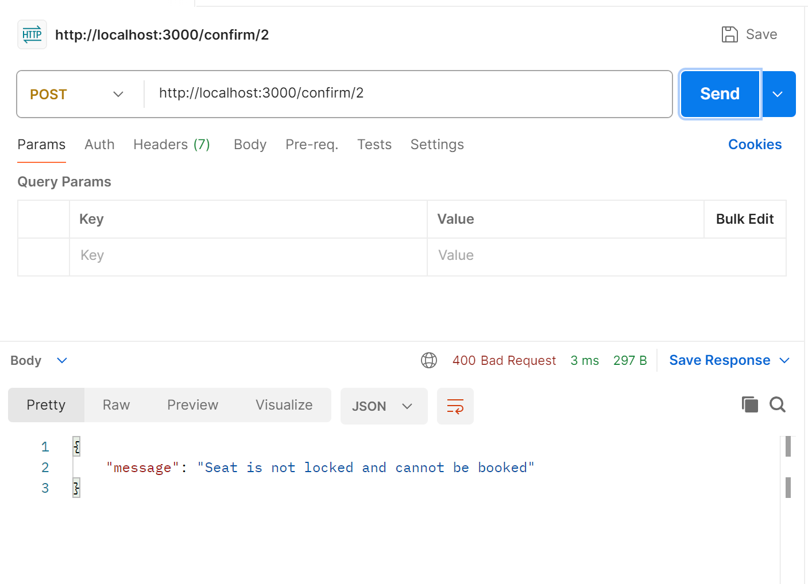
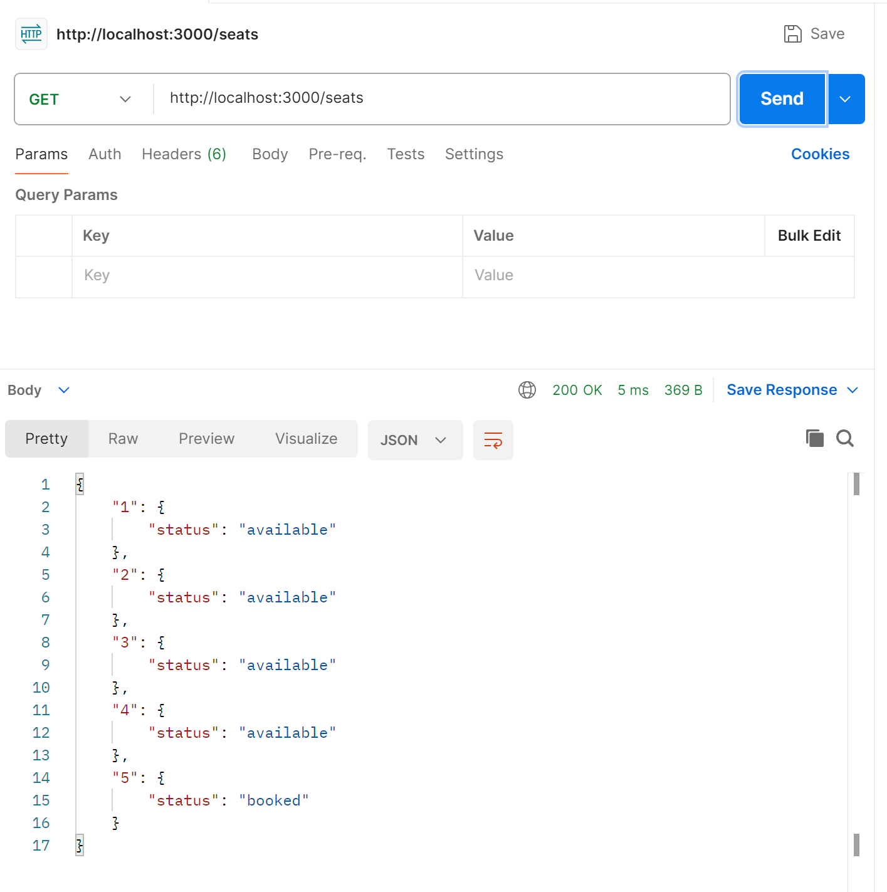
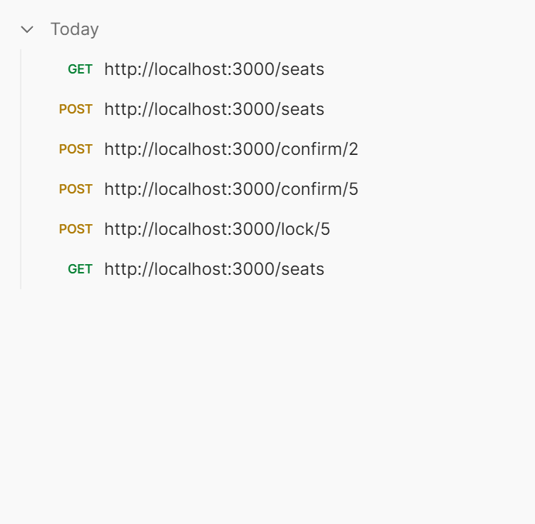

# Seat Booking System
This project implements a simple **seat booking system** using **Node.js + Express**.  
It ensures that seat locking and booking are handled safely with **mutex-based concurrency control**.  
A lock expires automatically after a configurable timeout (default: **60 seconds**).  


## Features
- Lock a seat for a limited duration before confirming.
- Auto-release if confirmation does not happen in time.
- Prevent double booking with **per-seat locks**.
- Endpoints to **lock, confirm, release, and check status** of seats.
- Simple mutex implementation (`KeyedMutex`) for handling concurrency.


## Code Explanation

1. **Seats Setup**  
   - At the start, the code creates 5 seats (numbered 1 to 5).  
   - Each seat has three properties:  
     - **status** → available, locked, or booked  
     - **lockTimestamp** → when it was locked  
     - **lockTimerId** → the timer that auto-expires the lock after 60s  

2. **KeyedMutex Class**  
   - This is like a “traffic controller” for each seat.  
   - It makes sure only one request (like lock/confirm) for the same seat is handled at a time.  
   - Prevents race conditions (two people booking the same seat at once).  

3. **isLockExpired Function**  
   - Checks if a seat’s lock has passed the 60-second limit.  
   - If yes, the seat should become available again.  

4. **`GET /seats` Function**  
   - Loops through all seats.  
   - If a lock expired, it marks the seat as available.  
   - Returns the current status of every seat.  

5. **`POST /lock/:id` Function**  
   - First, it acquires the mutex (only one action at a time for that seat).  
   - If the seat is already booked → gives an error.  
   - If the seat was locked but expired → resets it to available.  
   - If the seat is free → marks it as locked and starts a 60s timer.  
   - After the timer ends (if no confirm), it auto-releases the seat.  

6. **`POST /confirm/:id` Function**  
   - Also uses the mutex (to avoid conflicts).  
   - If seat is not locked → error.  
   - If lock expired → frees the seat and asks to lock again.  
   - If still locked → cancels the timer and permanently books the seat.  

7. **`POST /release/:id` Function**  
   - Uses mutex again.  
   - If seat is locked → clears the timer and makes it available again.  
   - If seat wasn’t locked → shows error.  

8. **app.listen Function**  
   - Starts the server on port 3000.  
   - Prints a message so you know the booking system is running.  

In simple words:  
- The **functions** in the code are like different helpers.  
- Some check seat status, some lock/unlock seats, and some confirm bookings.  
- The **mutex** ensures no two people mess with the same seat at the same exact moment.  


## Installation

1. Install dependencies:
```bash
npm install express
```
2. Run the server:
```bash
node server.js
```

3. Server will start at:
```bash
http://localhost:3000
```

## API Endpoints
1. Get Seats Status

GET /seats
Returns the status of all seats.

```json
{
  "1": { "status": "available" },
  "2": { "status": "booked" },
  "3": { "status": "locked" },
  "4": { "status": "available (lock expired)" },
  "5": { "status": "available" }
}
```

2. Lock a Seat

POST /lock/:id
Locks a seat for 60 seconds.

```json
{
  "message": "Seat 1 locked successfully. Confirm within 60 seconds."
}
```

3. Confirm Booking

POST /confirm/:id
Confirms the booking if the seat was locked and lock not expired.

```json
{
  "message": "Seat 1 booked successfully!"
}
```

4. Release a Seat

POST /release/:id
Releases a locked seat manually.

```json
{
  "message": "Seat 1 released"
}
```

## Lock Expiry
- Each lock lasts for **60 seconds** (configurable with `LOCK_DURATION_MS`).
- If the lock is not confirmed, the seat becomes **available automatically**.


## Output

### All Seats 


### Locking a Seat


### Confirming a Seat


### Comfirmed a Seat without Locking 


### Seat Status after Booking a Seat


### Postman Steps of performing this Experiment



## Tech Stack
- **Node.js**
- **Express.js**
- **JavaScript (ES6)**


## Learning Outcomes

By building this project, I have Learned:

- How to manage **in-memory state** for seat reservations.  
- How to implement **concurrent request handling** in Node.js using an async **Keyed Mutex**.  
- Designing and applying a **seat locking mechanism** to prevent double booking.  
- Handling **lock expiry and auto-release** using timers.  
- Creating REST APIs with **Express.js** that return meaningful success/error responses.  
- How to test concurrency by simulating multiple API calls.