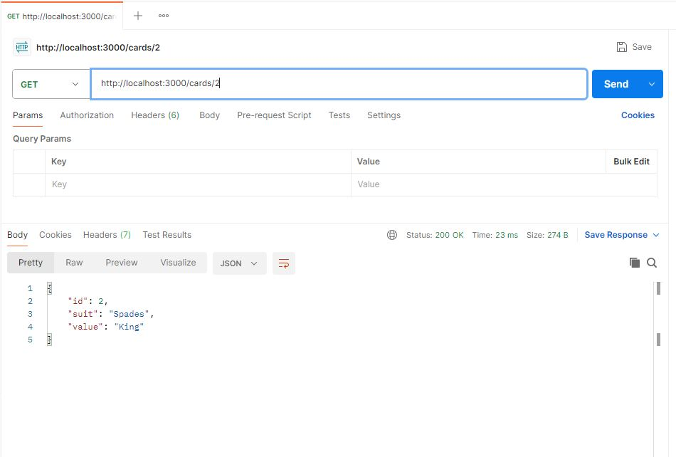
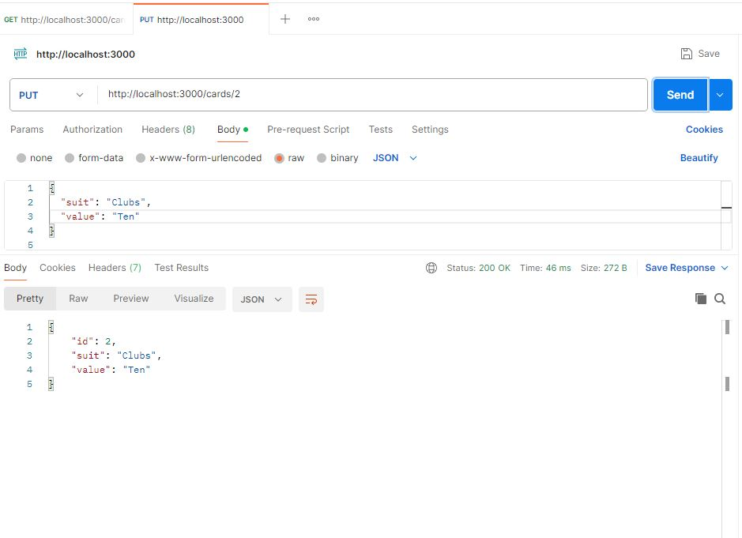
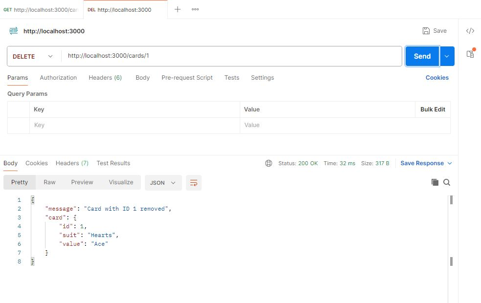
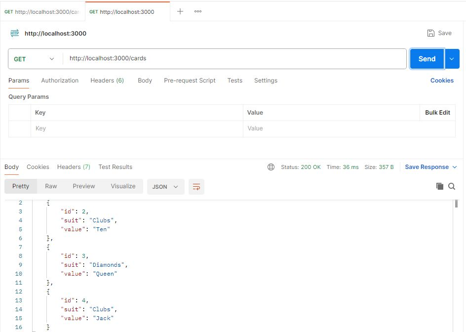

# REST API for Playing Card Collection Using Express.js

## Objective
Build a RESTful API using Express.js to manage a collection of playing cards.  
This project demonstrates routing, handling HTTP methods, and basic data manipulation in a Node.js backend environment.

---

## Project Structure
- `server.js` → The main JavaScript file containing all the API logic.  

## Features
1. **Add Employee (POST)** → Add a new employee with `id` and `name`.  
2. **List Employees (GET)** → Fetch all employees stored in the system.  
3. **Update Employee (PUT)** → Update both `id` and `name` of an employee.  
4. **Partial Update (PATCH)** → Update only one field (either `id` or `name`).  
5. **Remove Employee (DELETE)** → Delete an employee by their ID. 


## How It Works
1. **Initialize a Node.js project:**
```bash
npm init -y
```

2. **Install dependencies:**
```bash
npm install express
```

3. **Run the server:**
```bash
node server.js
```

4. **The server will run on:**
```arduino
http://localhost:3000
```

## Available Routes
| Method | Endpoint     | Description                                   | Request Body (JSON)                         | Example Response (JSON)                   |
| ------ | ------------ | --------------------------------------------- | ------------------------------------------- | ----------------------------------------- |
| GET    | `/cards`     | Get all cards in the collection               | None                                        | `[{"id":1,"suit":"Hearts","value":"A"}]`  |
| GET    | `/cards/:id` | Get a specific card by its ID                 | None                                        | `{"id":1,"suit":"Hearts","value":"A"}`    |
| POST   | `/cards`     | Add a new card                                | `{ "suit": "Spades", "value": "K" }`        | `{"id":2,"suit":"Spades","value":"K"}`    |
| PUT    | `/cards/:id` | Update an entire card (replace suit & value)  | `{ "suit": "Diamonds", "value": "10" }`     | `{"id":2,"suit":"Diamonds","value":"10"}` |
| DELETE | `/cards/:id` | Delete a card by its ID                       | None                                        | `{"message":"Card deleted successfully"}` |


## Testing API
Tested the endpoints using Postman

## Outputs

### GET All Cards 


### GET a Card


### POST Card with a Body


### PUT Card


### DELETE a Card


### GET a Card after Deletion


## Learning Outcomes
- Learned how to build a REST API with Express.js.
- Practiced handling HTTP methods: GET, POST, PUT, PATCH, DELETE.
- Strengthened understanding of request parameters and request body handling.
- Learned error handling for missing or invalid employee IDs.
- Understood how to structure a CRUD-based API in Node.js.
- Improved knowledge of API testing using Postman.
- Gained hands-on experience in modular coding for backend systems.